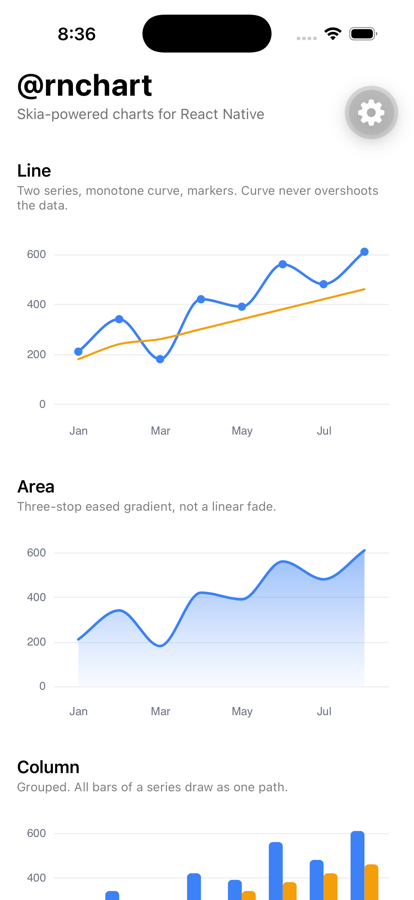
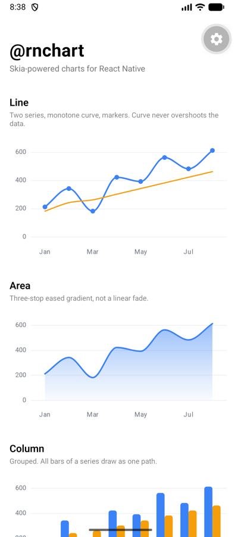
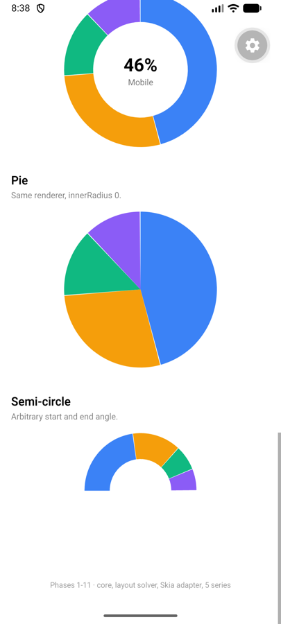
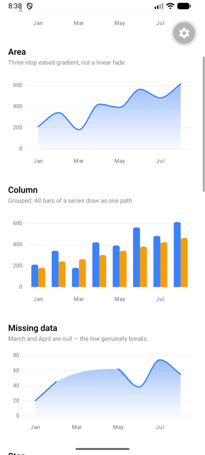
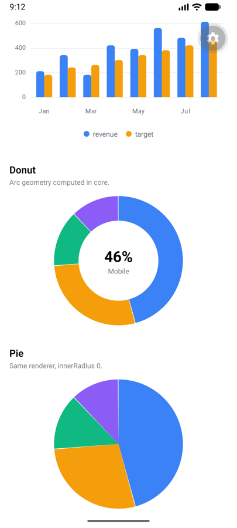
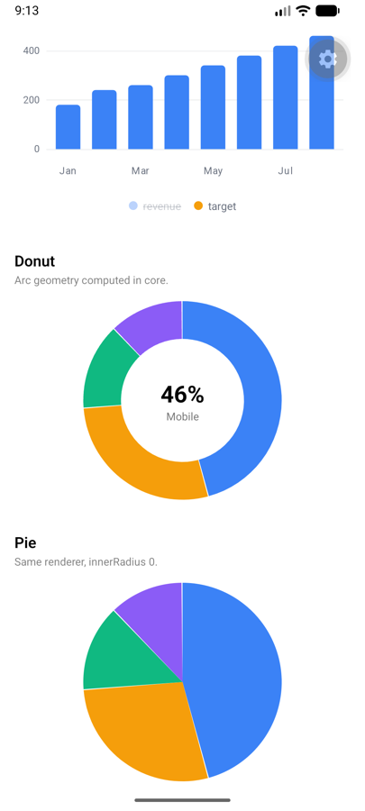

# react-native-graphify

**Skia-powered charts for React Native. Native performance, no WebView, one API for iOS and Android.**

<p align="center">
  
  
  
</p>
<p align="center">
  
  
  
</p>

<p align="center"><em>Real captures from the Android emulator and the iOS simulator — same source, same pixels.</em></p>

> **Status: pre-release.** Phases 1–14 of a 41-phase roadmap are complete. The
> library renders line, area, column, scatter, bubble, pie and donut charts with
> a touch cursor, crosshair, tooltip, legend and theme system. It is **not yet
> published to npm**. See [What's not done](#whats-not-done) before adopting.

## Install

```sh
npm install react-native-graphify
```

Peer dependencies you must already have:

```sh
npx expo install @shopify/react-native-skia react-native-reanimated react-native-worklets react-native-gesture-handler
```

Skia does not run in Expo Go — you need a [development build](https://docs.expo.dev/develop/development-builds/introduction/).

## Your first chart

```tsx
import { Area, Chart, Grid, XAxis, YAxis } from 'react-native-graphify';

const data = [
  { month: 'Jan', revenue: 210 },
  { month: 'Feb', revenue: 340 },
  { month: 'Mar', revenue: 180 },
  { month: 'Apr', revenue: 420 },
];

export function Revenue() {
  return (
    <Chart data={data} xKey="month" yKeys={['revenue']} height={220}>
      <Grid />
      <YAxis />
      <XAxis />
      <Area seriesKey="revenue" />
    </Chart>
  );
}
```

Add a touch cursor with a tooltip:

```tsx
<Chart data={data} xKey="month" yKeys={['revenue']} cursor haptics overlay={<Tooltip />}>
  <Grid />
  <YAxis />
  <XAxis />
  <Area seriesKey="revenue" />
  <Crosshair />
</Chart>
```

## What it does today

| Series | Status |
| --- | --- |
| Line — linear, monotone, step, stepAfter | ✅ |
| Area — eased gradient fill, configurable baseline | ✅ |
| Column — grouped, rounded outer corners, `minBarLength` | ✅ |
| Scatter — circle, square, diamond | ✅ |
| Bubble — sqrt radius so **area** encodes magnitude | ✅ |
| Pie, donut, semi-circle, arbitrary angles | ✅ |

| Feature | Status |
| --- | --- |
| Axes, grid, smart ticks, label collision resolution | ✅ |
| Touch cursor, crosshair, tooltip, haptics — all on the UI thread | ✅ |
| Legend with tap-to-toggle | ✅ |
| Theme system, light/dark, three verified palettes | ✅ |
| Decimation (LTTB, min/max) and hit-testing | ✅ |
| Missing-data policies — `gap`, `connect`, `zero` | ✅ |

## Why not react-native-svg?

An SVG chart creates one native view per element. A 500-point line is 500 views
that React must reconcile and the platform must lay out, every update. Skia
draws the same line as a single path into one canvas.

That difference is why this library batches aggressively: every grid line of one
orientation is a single `SkPath`, every bar of a series is a single `SkPath`,
every scatter point of a series is a single `SkPath`. At 200 bars that is the
difference between one draw call and two hundred.

## Honest comparison

| | react-native-graphify | gifted-charts | victory-native XL | chart-kit |
| --- | --- | --- | --- | --- |
| Renderer | Skia | react-native-svg | Skia | react-native-svg |
| Chart types | 7 today | ~15 | ~8 | ~6 |
| Web support | Planned (v3) | No | No | No |
| Maturity | **Pre-release** | Mature | Mature | Mature, low activity |
| Bundle (gzipped) | ~55 kB | — | — | — |

**Use gifted-charts today** if you want breadth and stability right now — it has
far more chart types and years of production use. **Use victory-native XL** if
you want a Skia renderer from a maintained project with a real user base.
This library is younger than both; its bets are the pure-TypeScript core (which
makes a web renderer an adapter rather than a rewrite) and interaction that never
touches the JS thread.

## Performance

Measured in Node on an Apple Silicon laptop. **These are not device numbers** —
device benchmarks in release builds on a mid-range Android phone are still
outstanding, and publishing laptop numbers as device numbers is how benchmark
tables lose their credibility.

| Operation | Measured | Roadmap target |
| --- | --- | --- |
| LTTB, 100k → 800 points | 0.32 ms | < 15 ms |
| Hit-test (x mode), 100k points | 0.0002 ms | < 0.1 ms |
| `clipToViewport`, 1M points | 0.0001 ms | — constant, proving it returns a view not a copy |
| Quadtree build, 50k points | 6.4 ms | once per data change, not per frame |

Run them yourself: `yarn bench`.

## Architecture

One package, three layers:

| Directory | What it is |
| --- | --- |
| [`src/core`](src/core) | Renderer-agnostic maths. Pure TypeScript, zero React Native, runs in plain Node. |
| [`src/skia`](src/skia) | Skia renderer adapter. |
| [`src/charts`](src/charts) | The components you import. |

`src/core` having no React Native dependency is not a style choice. Every
renderer is an adapter over it, which is why a web renderer stays adapter work
rather than a rewrite — the same reason victory-native had to drop web parity
when it moved to Skia. **A lint rule fails the build** if anything under
`src/core` imports React Native, so the boundary is enforced rather than
merely intended.

## Documentation

- [Getting started](docs/getting-started.md)
- [Chart types](docs/chart-types.md)
- [Interaction](docs/interaction.md)
- [Theming](docs/theming.md)
- [Performance](docs/performance.md)
- [Why not SVG?](docs/why-not-svg.md)
- [Architecture](CONTEXT.md)

## What's not done

Being explicit, because a feature table that hides gaps costs more trust than it buys:

- **Not published to npm.** Install instructions above will not work yet.
- **No device benchmarks.** Only Node numbers exist.
- **No screenshot regression tests.** See [docs/screenshot-testing.md](docs/screenshot-testing.md) for why the tool the roadmap named is not usable.
- **No accessibility layer.** Screen-reader support is phase 26.
- **No pan/zoom, streaming, drilldown or annotations** (v1.2.0).
- **No polar, radar or gauges** (v1.1.0).
- **No box plots, waterfall or histogram** (v1.3.0).
- **No plugin architecture or Highcharts adapter** (v2.0.0).
- **No financial module, heatmaps, treemaps, maps or Gantt.**
- **Pie and scatter are partial** — no slice explode, connector labels, quadtree-backed tap targets or trend lines yet.

## Development

Requires **Node 20+**. Yarn 4 comes from Corepack.

```sh
corepack enable
yarn install
yarn build && yarn test && yarn lint && yarn typecheck
```

Run the example app (needs a dev client — Skia does not run in Expo Go):

```sh
yarn example:ios       # or yarn example:android
yarn example           # fast loop once a dev client is installed
```

Metro resolves `react-native-graphify` to workspace source, so editing `src/`
hot-reloads the app with no rebuild.

| Script | Does |
| --- | --- |
| `yarn build` | Builds the library with builder-bob. |
| `yarn test` | Jest. |
| `yarn bench` | Performance benchmarks. |
| `yarn size` | Bundle budgets (needs a build first). |
| `yarn lint` / `yarn typecheck` / `yarn format` | Quality gates. |
| `yarn prepublish:check` | Verifies everything before a release. |

## Licence

MIT
